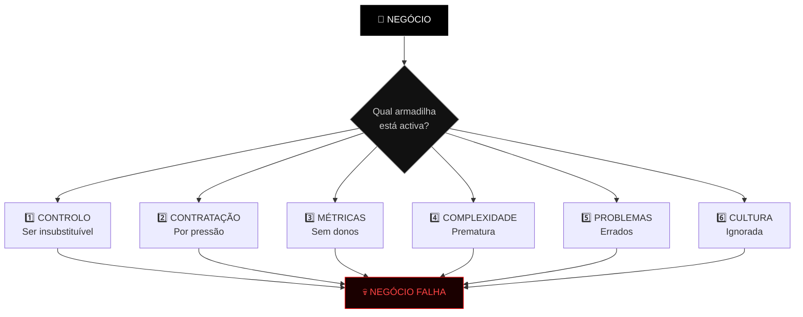
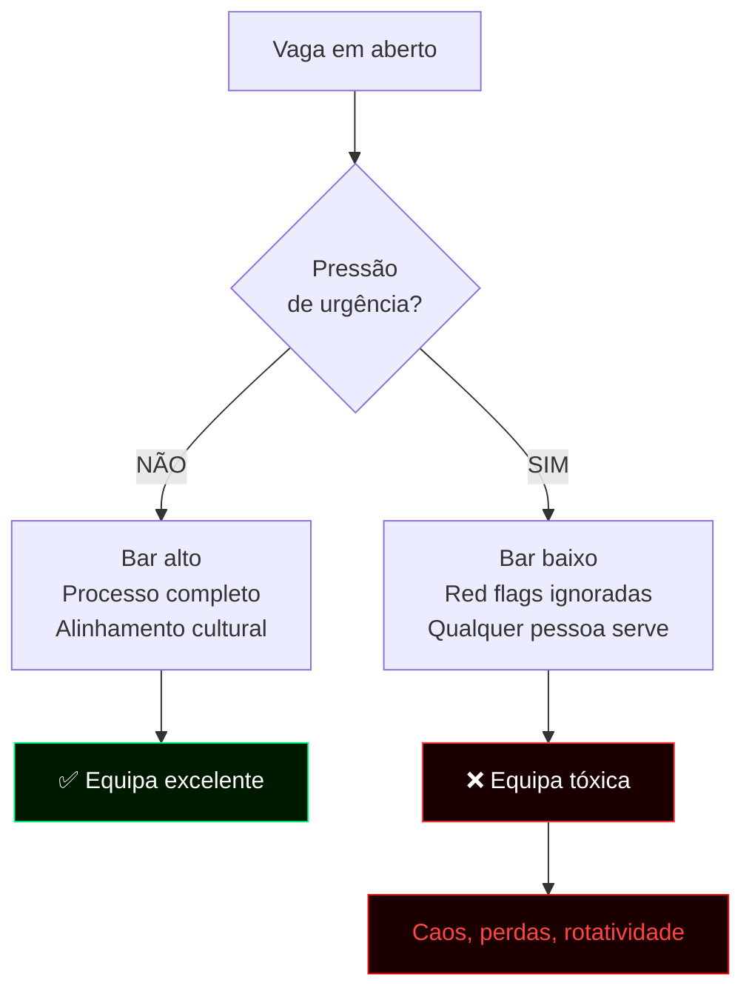
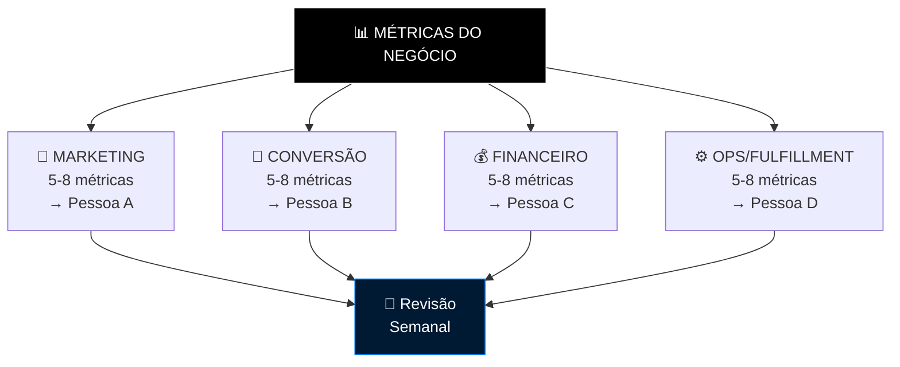
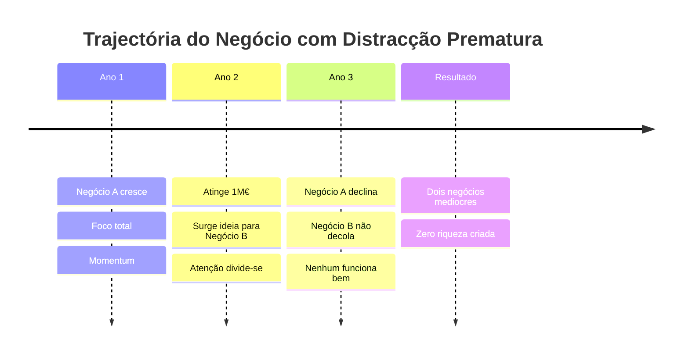
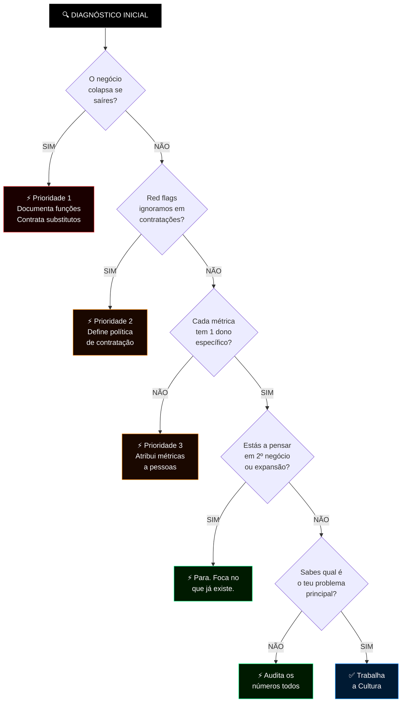

# ⚠️ Masterclass: As 6 Armadilhas que Matam Negócios
*Natalie Dawson — 1.000+ negócios estudados, equipa de 350+ pessoas*

> [!important] Verdade Brutal
> Não é o timing. Não é a concorrência. Não são as condições de mercado.
> São erros **estruturais e humanos** que matam negócios lentamente — e são 100% evitáveis.

---

## 🗺️ Visão Geral — O Mapa das 6 Armadilhas



---

## 📊 Dashboard de Diagnóstico Rápido

| # | Armadilha | Sinal de Alerta | Nível de Risco | Impacto |
|:---:|:---|:---|:---:|:---:|
| 1 | Controlo | *"Se eu sair, isto colapsa"* | 🔴 Crítico | Escalabilidade zero |
| 2 | Contratação | *"Vamos ver como corre"* | 🔴 Crítico | Equipa tóxica |
| 3 | Métricas sem dono | *"Toda a gente é responsável"* | 🟠 Alto | Crescimento bloqueado |
| 4 | Complexidade prematura | *"Tenho uma nova ideia"* | 🟠 Alto | Atenção dividida |
| 5 | Problemas errados | *"Precisamos de mais marketing"* | 🟡 Médio | Dinheiro desperdiçado |
| 6 | Cultura ignorada | *"Somos uma família"* | 🔴 Crítico | Empresa frágil |

---

## ☠️ Armadilha 1 — Controlo: Seres Insubstituível


### O Ciclo Vicioso vs. O Ciclo Virtuoso

| ❌ Ciclo Vicioso | ✅ Ciclo Virtuoso |
|:---|:---|
| Fundador faz as tarefas que domina | Fundador documenta o que faz |
| Ninguém aprende a fazer igual | Contrata e treina substituto |
| Negócio para se ele parar | Liberta-se para escalar |
| Não consegue vender o negócio | Negócio funciona sem ele |

### Protocolo de Auto-Substituição

```
PASSO 1 → Dá-te um título real baseado no que fazes
          (ex: "Senior Sales Rep" em vez de "CEO")

PASSO 2 → Documenta tudo o que fazes nessa função diariamente

PASSO 3 → Define targets como se fosse avaliar um colaborador

PASSO 4 → Contrata e treina a pessoa certa para esse papel
```

> [!tip] Regra de Ouro
> Se o teu negócio colapsa quando vais de férias — **não tens um negócio, tens um emprego disfarçado.**

---

## ☠️ Armadilha 2 — Contratação por Pressão

### O Que Acontece Sob Pressão



### Alta Exigência vs. Pressão

| Critério | 🟢 Contratação com Exigência | 🔴 Contratação por Pressão |
|:---|:---|:---|
| **Bar de entrada** | Alto — alinhamento com valores | Baixo — preenche o lugar |
| **Red flags** | Motivo automático de rejeição | Ignoradas ou racionalizadas |
| **Tempo** | Pode ser 1 semana (com processo) | Rápida mas sem critério |
| **Resultado** | Equipa fortalecida | Equipa contaminada |
| **Efeito colateral** | Confiança e crescimento | Caos e perdas |

> [!warning] Caso Real
> Natalie contratou em modo urgência sem seguir o processo. Resultado: **€10.000+ roubados** e dinâmica de equipa destruída.

### A Política Inegociável

> **Se detectas uma red flag na entrevista → não contratas.**
> Sem excepções. Sem "vamos ver". Sem "precisamos de alguém agora".

**Mantém sempre presente:** Há sempre pessoas excelentes que querem trabalhar numa empresa em crescimento. O bar não desce — nunca.

---

## ☠️ Armadilha 3 — Escalar Sem Donos de Métricas

### O Sistema de Atribuição



### A Regra das Métricas

| Errado ❌ | Certo ✅ |
|:---|:---|
| "Toda a gente é responsável" | 1 métrica = 1 pessoa = 1 revisão semanal |
| Lista de 30 KPIs sem dono | 5-8 métricas por área com dono específico |
| Fundador persegue tudo | Fundador revê os donos, não as métricas |
| Confusão de prioridades | A métrica é **a** prioridade #1 do colaborador |

---

## ☠️ Armadilha 4 — Complexidade Prematura

### O Padrão Destrutivo



### O Case do Dentista

| Situação | O Que Aconteceu |
|:---|:---|
| **Dentista em Scottsdale** | Clínica de sucesso. Quer férias em Tahoe. |
| **Decisão** | Abre segunda clínica em Tahoe. |
| **Resultado em Scottsdale** | Atenção retirada → clínica declina |
| **Resultado em Tahoe** | Sem mesma equipa/sistemas → não funciona |
| **Tahoe como férias** | Impossível — está a trabalhar lá |
| **Conclusão** | Perdeu o negócio original + não criou o novo |

> **Menos, feito melhor. Sempre.**

### A Regra de Foco

```
Até poderes VENDER o primeiro negócio:
  ✗ Não abres segundo negócio
  ✗ Não expandes para localização desconectada
  ✓ Deitas gasolina no que já funciona
  ✓ Keep the main thing the main thing
```

---

## ☠️ Armadilha 5 — Resolver os Problemas Errados

### A Analogia da Massa

```mermaid
flowchart LR
    subgraph ERRADO["❌ O Que Acontece"]
        A[Aperfeiçoas\nMolho + Carne\n⏱️ 3 horas] 
        B[Esparguete\nno Microondas\n💀 Não cozinha]
    end
    subgraph RESULTADO["😤 Resultado"]
        C[Molho perfeito\n+\nEsparguete crua\n=\nJantar falhado]
    end
    ERRADO --> RESULTADO

    style ERRADO fill:#1a0000,stroke:#ff4444
    style RESULTADO fill:#111,stroke:#888
```



### Diagnóstico Real vs. Diagnóstico Assumido

| Sintoma Visível | Diagnóstico Assumido ❌ | Diagnóstico Real ✅ |
|:---|:---|:---|
| Leads não convertem | "Precisamos de mais leads" | Equipa de vendas sem processo |
| Revenue estagnado | "Precisamos de marketing" | LTV dos clientes está a cair |
| Churn alto | "Produto fraco" | Onboarding deficiente |
| Equipa improdutiva | "Precisamos de mais pessoas" | Métricas sem donos |

> [!warning] Caso Real
> Empresa a gastar **€30.000/mês em publicidade**, múltiplas agências, zero resultados. Diagnóstico assumido: problema de marketing. Diagnóstico real: **equipa de vendas sem formação e sem processo**.

### O Princípio

> Nunca confies na opinião do fundador sobre qual é o problema.
> **Os números dizem sempre a verdade. Mede tudo.**

---

## ☠️ Armadilha 6 — Ignorar a Cultura

### Cultura Falsa vs. Cultura Real

```mermaid
flowchart TD
    subgraph FALSA["❌ Cultura Falsa"]
        F1[Happy Hours]
        F2[Ping Pong]
        F3[Ser amigo da equipa]
        F4[Team building genérico]
    end
    subgraph REAL["✅ Cultura Real"]
        R1[Onboarding que define\no sucesso claramente]
        R2[Incentivos alinhados\ncom objectivos]
        R3[Feedback e coaching\nde métricas]
        R4[Processo definido\npara cada função]
    end
    FALSA -->|"Resulta em"| X[❌ Negócio frágil\ndependente de personalidades]
    REAL -->|"Resulta em"| Y[✅ Sistema que funciona\nindependente de quem está]

    style FALSA fill:#1a0000,stroke:#ff4444
    style REAL fill:#001a00,stroke:#00ff88
    style X fill:#1a0000,stroke:#ff0000,color:#ff4444
    style Y fill:#001a00,stroke:#00ff88,color:#00ff88
```



### A Consequência do Atraso

| Fase | Sem Cultura Estruturada | Com Cultura Estruturada |
|:---|:---|:---|
| **0-10 pessoas** | Improviso aceitável | Base sólida instalada |
| **10-50 pessoas** | Caos começa | Sistemas escalam |
| **50+ pessoas** | Pessoas sénior recusam entrar | Atrai os melhores talentos |
| **Saída/Venda** | Negócio vale menos | Negócio tem valor sistémico |

> **O trabalho de um líder real: tornar o sucesso dos outros fácil.**

### Checklist de Cultura Real

- [ ] Cada função tem processo documentado para o sucesso
- [ ] Cada colaborador sabe exactamente quais são as suas métricas
- [ ] Existe feedback estruturado (não só quando algo corre mal)
- [ ] O onboarding demonstra o sucesso possível desde o primeiro dia
- [ ] A empresa funciona quando o fundador está ausente

---

## 🎯 Protocolo de Implementação — Por Onde Começar



---

> [!quote] Princípio Final
> *"Os negócios de maior sucesso não precisam de mais — precisam de menos, feito melhor. A riqueza real vem de aprofundar o que já funciona, não de dispersar energia em novas aventuras antes de a primeira estar sólida o suficiente para se sustentar sozinha."*
> — Natalie Dawson

---

*Fonte: Natalie Dawson — 1.000+ negócios estudados, equipa actual 350+ pessoas*
