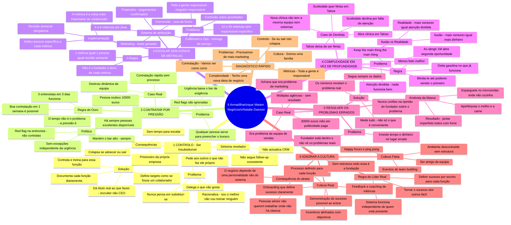

# 🗺️ Mapa Mental: As 6 Armadilhas que Matam Negócios

```mermaid
mindmap
  root((6 Armadilhas\nque Matam Negócios\nNatalie Dawson))
    1 CONTROLO - Ser Insubstituível
      Problema
        Delega o que não gosta
        Nunca pensa em substituir-se
        Racionaliza - sou o melhor não vou treinar ninguém
      Consequências
        Prisioneiro da própria empresa
        Colapsa se adoecer ou sair
        Sem tempo para escalar
      Sintoma revelador
        Pede aos outros o que não faz ele próprio
        Não actualiza CRM
        Não segue follow-up consistente
      Solução
        Dá título real ao que fazes - recruiter não CEO
        Documenta cada função diariamente
        Define targets como se fosse um colaborador
        Contrata e treina para essa função
    2 CONTRATAR POR PRESSÃO
      Problema
        Urgência baixa o bar de exigência
        Red flags são ignoradas
        Qualquer pessoa serve para preencher o buraco
      Caso Real
        Contratação rápida sem processo
        Pessoa roubou 10000 euros
        Destruiu dinâmica da equipa
      Regra de Ouro
        Boa contratação em 1 semana é possível
        3 entrevistas em 3 dias funciona
        O tempo não é o problema - a pressão é
      Política
        Red flag na entrevista - não contratas
        Sem excepções independente da urgência
        Há sempre pessoas excelentes disponíveis
        Mantém o bar alto - sempre
    3 ESCALAR SEM DONOS DE MÉTRICAS
      Problema
        10 a 30 métricas sem responsável específico
        Toda a gente responsável - ninguém responsável
        Confusão sobre prioridades
      A Regra
        1 métrica igual 1 pessoa igual revisão semanal
        Não é o fundador o dono de cada métrica
      Sistema de atribuição
        Marketing - leads geradas
        Conversão - taxa de fecho
        Financeiro - pagamentos confirmados
        Fulfillment e Ops - entrega do serviço
        5 a 8 métricas por área
      Implementação
        Atribui pessoa específica a cada métrica
        Revisão semanal obrigatória
        A métrica é a coisa mais importante do colaborador
    4 COMPLEXIDADE EM VEZ DE PROFUNDIDADE
      Problema
        Ao atingir 1M abre segunda oportunidade
        Atenção dividida - nada funciona bem
      Ilusão vs Realidade
        Ilusão - mais ventures igual mais dinheiro
        Realidade - mais ventures igual atenção dividida
      Caso do Dentista
        Scottsdale quer férias em Tahoe
        Abre clínica em Tahoe
        Tahoe deixa de ser férias
        Scottsdale declina por falta de atenção
        Nova clínica não tem a mesma equipa nem sistemas
      Regra
        Menos feito melhor
        Blinda-te até poderes vender o primeiro
        Deita gasolina no que já funciona
        Keep the main thing the main thing
    5 RESOLVER OS PROBLEMAS ERRADOS
      Problema
        Fundador está dentro e não vê os problemas reais
        Investe tempo e dinheiro no lugar errado
      Caso Real
        30000 euros mês em publicidade paga
        Múltiplas agências - sem resultado
        Achava que era problema de marketing
        Era problema da equipa de vendas
      Analogia da Massa
        Aperfeiçoas o molho e a carne
        Esparguete no microondas onde não cozinha
        Resultado - jantar imperfeito todos com fome
      Solução
        Mede tudo - não só o que é conveniente
        Nunca confies na opinião do fundador sobre o problema
        Os números revelam o problema real
        Segue sempre os dados
    6 IGNORAR A CULTURA
      Cultura Falsa
        Happy hours e ping pong
        Ser amigo da equipa
        Eventos de team building
        Ambiente descontraído sem estrutura
      Cultura Real
        Demonstração do sucesso possível ao entrar
        Onboarding que define sucesso claramente
        Incentivos alinhados com objectivos
        Feedback e coaching de métricas
        Processo definido para cada função
      Consequência do atraso
        Sem estrutura cedo essa é a fundação
        Pessoas sénior não querem trabalhar onde não há clareza
        O negócio depende de uma personalidade não do sistema
      Regra do Líder Real
        Tornar o sucesso dos outros fácil
        Definir sucesso por escrito para cada função
        Sistema funciona independente de quem está presente
    DIAGNÓSTICO RÁPIDO
      Controlo - Se eu sair isto colapsa
      Contratação - Vamos ver como corre
      Métricas - Toda a gente é responsável
      Complexidade - Tenho uma nova ideia de negócio
      Problemas - Precisamos de mais marketing
      Cultura - Somos uma família
```
