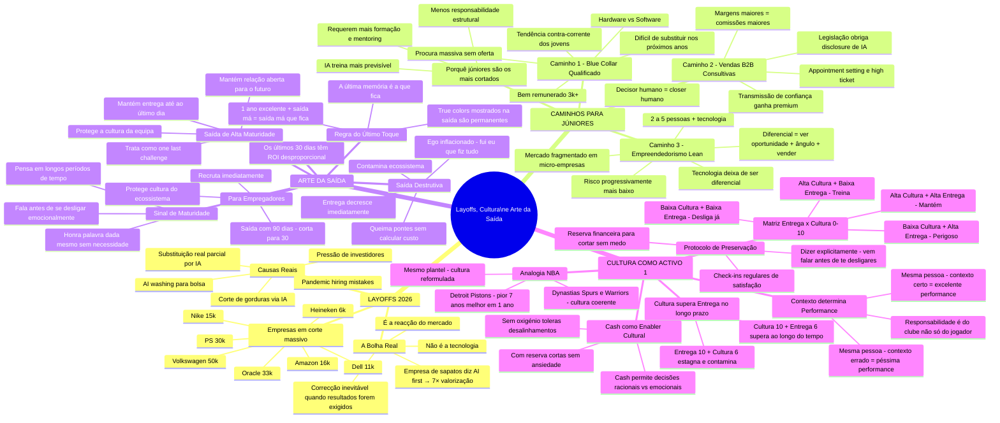

# 🗺️ Mapa Mental: Layoffs, Cultura e Arte da Saída

```mermaid
mindmap
  root((Layoffs, Cultura\ne Arte da Saída))
    LAYOFFS 2026
      Empresas em corte massivo
        Volkswagen 50k
        Oracle 33k
        PS 30k
        Amazon 16k
        Nike 15k
        Dell 11k
        Heineken 6k
      Causas Reais
        Pandemic hiring mistakes
        Corte de gorduras via IA
        AI washing para bolsa
        Pressão de investidores
        Substituição real parcial por IA
      A Bolha Real
        Não é a tecnologia
        É a reacção do mercado
        Empresa de sapatos diz AI first → 7× valorização
        Correcção inevitável quando resultados forem exigidos
    CAMINHOS PARA JÚNIORES
      Porquê júniores são os mais cortados
        Menos responsabilidade estrutural
        Requerem mais formação e mentoring
        IA treina mais previsível
      Caminho 1 - Blue Collar Qualificado
        Difícil de substituir nos próximos anos
        Hardware vs Software
        Procura massiva sem oferta
        Bem remunerado 3k+
        Tendência contra-corrente dos jovens
      Caminho 2 - Vendas B2B Consultivas
        Decisor humano = closer humano
        Transmissão de confiança ganha premium
        Legislação obriga disclosure de IA
        Margens maiores = comissões maiores
        Appointment setting e high ticket
      Caminho 3 - Empreendedorismo Lean
        Mercado fragmentado em micro-empresas
        2 a 5 pessoas + tecnologia
        Tecnologia deixa de ser diferencial
        Diferencial = ver oportunidade + ângulo + vender
        Risco progressivamente mais baixo
    ARTE DA SAÍDA
      Os últimos 30 dias têm ROI desproporcional
      Saída Destrutiva
        Entrega decresce imediatamente
        Contamina ecossistema
        Queima pontes sem calcular custo
        Ego inflacionado - fui eu que fiz tudo
      Saída de Alta Maturidade
        Mantém entrega até ao último dia
        Protege a cultura da equipa
        Trata como one last challenge
        Mantém relação aberta para o futuro
      Regra do Último Toque
        A última memória é a que fica
        1 ano excelente + saída má = saída má que fica
        True colors mostrados na saída são permanentes
      Para Empregadores
        Saída com 90 dias - corta para 30
        Recruta imediatamente
        Protege cultura do ecossistema
      Sinal de Maturidade
        Honra palavra dada mesmo sem necessidade
        Pensa em longos períodos de tempo
        Fala antes de se desligar emocionalmente
    CULTURA COMO ACTIVO 1
      Matriz Entrega x Cultura 0-10
        Alta Cultura + Alta Entrega - Mantém
        Alta Cultura + Baixa Entrega - Treina
        Baixa Cultura + Alta Entrega - Perigoso
        Baixa Cultura + Baixa Entrega - Desliga já
      Cultura supera Entrega no longo prazo
        Cultura 10 + Entrega 6 supera ao longo do tempo
        Entrega 10 + Cultura 6 estagna e contamina
      Cash como Enabler Cultural
        Sem oxigénio toleras desalinhamentos
        Com reserva cortas sem ansiedade
        Cash permite decisões racionais vs emocionais
      Contexto determina Performance
        Mesma pessoa - contexto errado = péssima performance
        Mesma pessoa - contexto certo = excelente performance
        Responsabilidade é do clube não só do jogador
      Analogia NBA
        Dynastias Spurs e Warriors - cultura coerente
        Detroit Pistons - pior 7 anos melhor em 1 ano
        Mesmo plantel - cultura reformulada
      Protocolo de Preservação
        Check-ins regulares de satisfação
        Dizer explicitamente - vem falar antes de te desligares
        Reserva financeira para cortar sem medo
```
