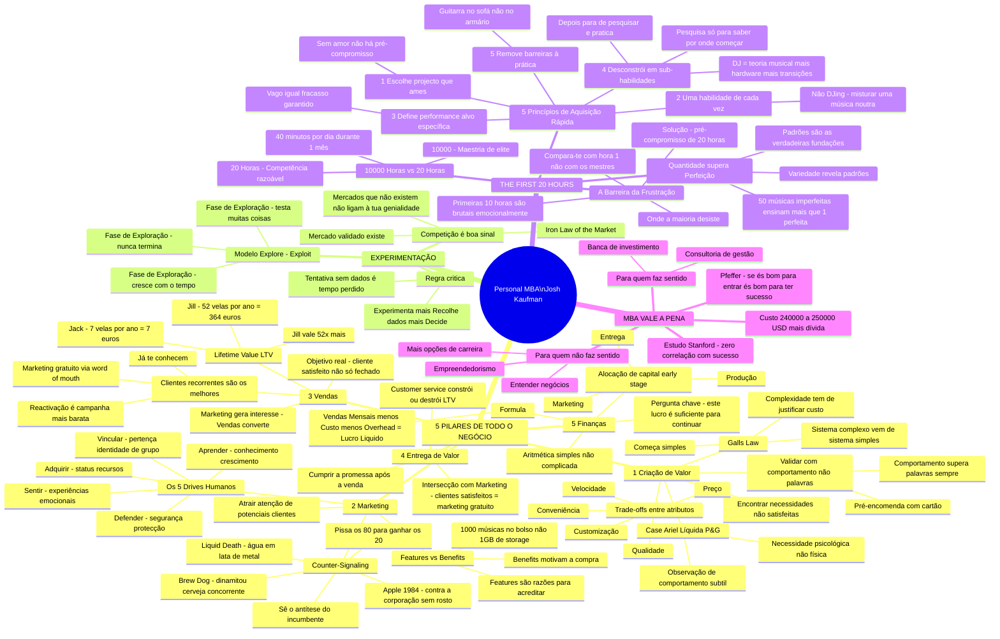

# 🗺️ Mapa Mental: Personal MBA — Os 5 Pilares + 20 Horas

```mermaid
mindmap
  root((Personal MBA\nJosh Kaufman))
    5 PILARES DE TODO O NEGÓCIO
      1 Criação de Valor
        Encontrar necessidades não satisfeitas
        Trade-offs entre atributos
          Preço
          Qualidade
          Velocidade
          Customização
          Conveniência
        Validar com comportamento não palavras
          Pré-encomenda com cartão
          Comportamento supera palavras sempre
        Case Ariel Líquida P&G
          Necessidade psicológica não física
          Observação de comportamento subtil
        Galls Law
          Sistema complexo vem de sistema simples
          Começa simples
          Complexidade tem de justificar custo
      2 Marketing
        Atrair atenção de potenciais clientes
        Os 5 Drives Humanos
          Adquirir - status recursos
          Vincular - pertença identidade de grupo
          Aprender - conhecimento crescimento
          Defender - segurança protecção
          Sentir - experiências emocionais
        Counter-Signaling
          Sê o antítese do incumbente
          Liquid Death - água em lata de metal
          Brew Dog - dinamitou cerveja concorrente
          Apple 1984 - contra a corporação sem rosto
          Pissa os 80 para ganhar os 20
        Features vs Benefits
          Benefits motivam a compra
          Features são razões para acreditar
          1000 músicas no bolso não 1GB de storage
      3 Vendas
        Marketing gera interesse - Vendas converte
        Objetivo real - cliente satisfeito não só fechado
        Lifetime Value LTV
          Jack - 7 velas por ano = 7 euros
          Jill - 52 velas por ano = 364 euros
          Jill vale 52x mais
        Clientes recorrentes são os melhores
          Já te conhecem
          Marketing gratuito via word of mouth
          Reactivação é campanha mais barata
      4 Entrega de Valor
        Cumprir a promessa após a venda
        Intersecção com Marketing - clientes satisfeitos = marketing gratuito
        Customer service constrói ou destrói LTV
      5 Finanças
        Aritmética simples não complicada
        Formula
          Vendas Mensais menos Custo menos Overhead = Lucro Liquido
        Pergunta chave - este lucro é suficiente para continuar
        Alocação de capital early stage
          Produção
          Marketing
          Entrega
    EXPERIMENTAÇÃO
      Modelo Explore - Exploit
        Fase de Exploração - testa muitas coisas
        Fase de Exploração - cresce com o tempo
        Fase de Exploração - nunca termina
      Regra critica
        Experimenta mais Recolhe dados mais Decide
        Tentativa sem dados é tempo perdido
      Competição é boa sinal
        Mercado validado existe
        Iron Law of the Market
        Mercados que não existem não ligam à tua genialidade
    THE FIRST 20 HOURS
      10000 Horas vs 20 Horas
        10000 - Maestria de elite
        20 Horas - Competência razoável
        40 minutos por dia durante 1 mês
      5 Princípios de Aquisição Rápida
        1 Escolhe projecto que ames
          Sem amor não há pré-compromisso
        2 Uma habilidade de cada vez
          Não DJing - misturar uma música noutra
        3 Define performance alvo específica
          Vago igual fracasso garantido
        4 Desconstrói em sub-habilidades
          DJ = teoria musical mais hardware mais transições
          Pesquisa só para saber por onde começar
          Depois para de pesquisar e pratica
        5 Remove barreiras à prática
          Guitarra no sofá não no armário
      A Barreira da Frustração
        Primeiras 10 horas são brutais emocionalmente
        Onde a maioria desiste
        Solução - pré-compromisso de 20 horas
        Compara-te com hora 1 não com os mestres
      Quantidade supera Perfeição
        50 músicas imperfeitas ensinam mais que 1 perfeita
        Variedade revela padrões
        Padrões são as verdadeiras fundações
    MBA VALE A PENA
      Estudo Stanford - zero correlação com sucesso
      Pfeffer - se és bom para entrar és bom para ter sucesso
      Custo 240000 a 250000 USD mais dívida
      Para quem faz sentido
        Consultoria de gestão
        Banca de investimento
      Para quem não faz sentido
        Empreendedorismo
        Entender negócios
        Mais opções de carreira
```
