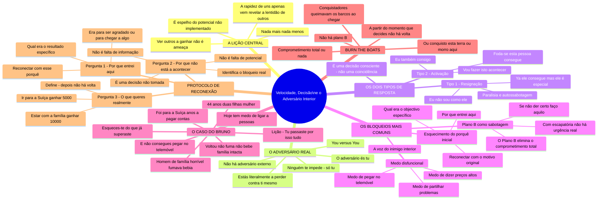

# 🗺️ Mapa Mental: Velocidade, Decisão e o Adversário Interior

```mermaid
mindmap
  root((Velocidade, Decisão\ne o Adversário Interior))
    A LIÇÃO CENTRAL
      A rapidez de uns apenas vem revelar a lentidão de outros
      Ver outros a ganhar não é ameaça
      É espelho do potencial não implementado
      Nada mais nada menos
    O ADVERSÁRIO REAL
      You versus You
      Não há adversário externo
      O adversário és tu
      Estás literalmente a perder contra ti mesmo
      Ninguém te impede - só tu
    OS DOIS TIPOS DE RESPOSTA
      Tipo 1 - Resignação
        Ya ele consegue mas ele é especial
        Eu não sou como ele
        Paralisia e autossabotagem
      Tipo 2 - Activação
        Foda-se esta pessoa consegue
        Eu também consigo
        Vou fazer isto acontecer
      É uma decisão consciente - não uma coincidência
    OS BLOQUEIOS MAIS COMUNS
      Esquecimento do porquê inicial
        Por que entrei aqui
        Qual era o objectivo específico
        Reconectar com o motivo original
      Medo disfuncional
        Medo de pegar no telemóvel
        Medo de dizer preços altos
        Medo de partilhar problemas
        A voz do inimigo interior
      Plano B como sabotagem
        Se não der certo faço aquilo
        O Plano B elimina o comprometimento total
        Com escapatória não há urgência real
    O CASO DO BRUNO
      44 anos duas filhas mulher
      Homem de família horrível fumava bebia
      Foi para a Suíça anos a pagar contas
      Voltou não fuma não bebe família intacta
      Hoje tem medo de ligar a pessoas
      Lição - Tu passaste por isso tudo
      E não consegues pegar no telemóvel
      Esqueces-te do que já superaste
    BURN THE BOATS
      Conquistadores queimavam os barcos ao chegar
      Ou conquisto esta terra ou morro aqui
      Não há plano B
      A partir do momento que decides não há volta
      Comprometimento total ou nada
    PROTOCOLO DE RECONEXÃO
      Pergunta 1 - Por que entrei aqui
        Qual era o resultado específico
        Era para ser agradado ou para chegar a algo
        Reconectar com esse porquê
      Pergunta 2 - Por que não está a acontecer
        Identifica o bloqueio real
        Não é falta de potencial
        Não é falta de informação
        É uma decisão não tomada
      Pergunta 3 - O que queres realmente
        Ir para a Suíça ganhar 5000
        Estar com a família ganhar 10000
        Define - depois não há volta
```
