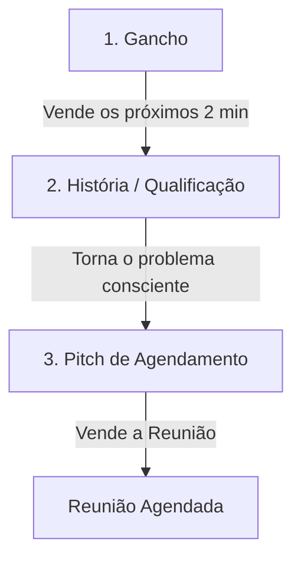

# 📞 O Funil de Cold Call: Estrutura para Reuniões de Sucesso

**Objetivo:** Compreender a estrutura de 3 etapas de uma ligação fria para aumentar a taxa de agendamento e o comparecimento (show-up) nas reuniões.

**Categoria:** #vendas #prospecção #cold-call #script
**Nível:** Intermediário

---

## 💡 Ideia Principal

> **"Tudo em vendas é um funil. Cold call não é diferente. O objetivo da cold call é agendar a reunião. E de nada adianta agendar se o lead não comparecer. Este funil serve para vender a ideia de que vale a pena o lead separar 1 hora do tempo dele para você."**

---

## 🏗️ A Estrutura do Funil

### 1. Gancho (O "Convite" para a Dança)
É a parte mais rápida e importante. Serve para ganhar os próximos 2 minutos da ligação.
*   **O que fazer:** Gerar desejo e dar uma ideia do que você faz, sem revelar o "como". Fale do que o lead **quer** (resultado), não do que você **vende** (serviço).
*   **Meta:** Vender a retenção. O lead decide se desliga ou se ouve.

### 2. História (Autoridade e Consciência)
Aqui você gera autoridade e qualifica o lead.
*   **O que fazer:** Falar brevemente da sua empresa, trazer prova social e fazer perguntas para entender as dores e o nível de consciência do lead.
*   **O Trabalho do Vendedor:**
    *   *Se o lead está inconsciente:* Torne o problema claro.
    *   *Se o lead está consciente:* "Enfie a faca". Implique o problema, mostre as consequências de não agir e deixe a dor latente.
*   **Meta:** O lead deve admitir (para si mesmo) que tem um problema que precisa ser resolvido.

### 3. Pitch (A Venda da Reunião)
É a parte final: o fechamento do agendamento.
*   **O que fazer:** Vender a ideia de que o tempo dele (45-60 min) será bem gasto em uma reunião com a sua empresa.
*   **Importante:** Não é uma venda monetária ainda. É a venda da **atenção**.
*   **Meta:** Compromisso na agenda.

---

## 🎯 Aplicação Prática (Elite Agency)

Ao fazer prospecção de leads High Ticket:
1.  **Gancho:** "Vi que vocês são referência em [Nicho] em [Cidade], estou te ligando porque ajudamos empresas como a sua a [Resultado] sem precisar de [Objeção Comum]."
2.  **História:** "Recentemente trabalhamos com [Caso de Sucesso] onde o problema era [Dor]. Como está esse processo aí com vocês hoje?"
3.  **Pitch:** "Baseado no que você me disse sobre [Dor], faz sentido abrirmos 45 minutos na [Dia X] para eu te mostrar o framework que usamos para resolver isso?"

---

## 🔗 Conexões
- **Relacionado a:** [[10-Warm-Call-Outreach]], [[09-Discovery-Call-Guião]], [[29-Psicologia-da-Objecao-Nao-Tenho-Interesse]]
- **Aplica-se a:** [[16-Sistema-Qualificação-Leads]], [[Prospecção-Ativa]]

---
*Nota: Agendar por agendar é perda de tempo. Agende vendendo o valor da solução.*
